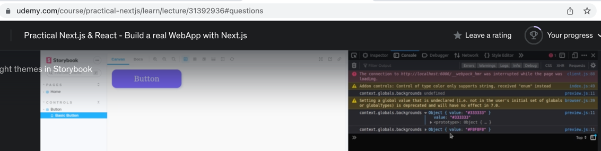
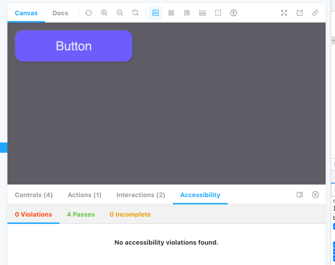
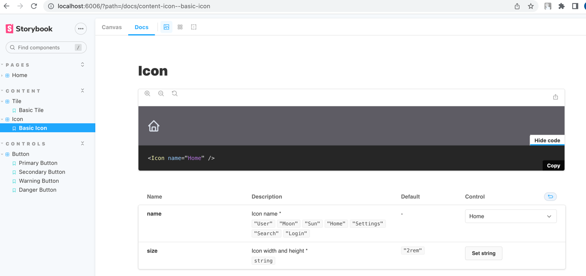

 
# Section 1. Intro
## 1. Create-next-app with Typescript
 
`npx create-next-app@latest --ts`
`npm run dev`

https://github.com/nickovchinnikov/coursesbox

## 3. NextJS and Storybook

`npx sb init --builder webpack5`
`yes` for _eslintPlugin

https://github.com/storybookjs/eslint-plugin-storybook#usage

Add "plugin:storybook/recommended"
```json
{
  "extends": [
    "next/core-web-vitals",
    "plugin:storybook/recommended"
  ]
}
```

`npm run storybook`

## 4. Images Optimization and Storybook

_.storybook/main.js_

create file
_coursesbox/stories/Home.stories.tsx_
```jsx
import Home from "../pages";

export default {
    title: 'Pages/Home',
    Component: Home,
}

export const HomePage = () => <Home />
```

We don't have image in storybook

Big part of Next is Image component and Image optimization

Point to static folder `-s ./public`  
_package.json_
```json
    "storybook": "start-storybook -p 6006 -s ./public",
```
_coursesbox/.storybook/preview.js_
```javascript
import * as NextImage from "next/image";

const OriginalNextImage = NextImage.default;

Object.defineProperty(NextImage, 'default', {
    configurable: true,
    value: (props) => <OriginalNextImage {...props} unoptimized />
});
```

## 5. Prettier
`npm install --save-dev --save-exact prettier`
` npm i -D eslint-plugin-prettier`

_.eslintrc.json_
```json
  "plugins": [
    "prettier"
  ],
  "rules": {
    "prettier/prettier": "error"
  }
```

## 6. CSS-IN-JS. EmotionJS

use _raw strings_
` npm i --save @emotion/styled @emotion/react`

## 7. The first component

---
Error:
Cannot find module 'webpack/lib/util/makeSerializable.js"
https://github.com/storybookjs/storybook/issues/15336

Solution:
install webpack as a dev dependency


# Section 2. The power of storybook

## Jest and react testing library

`npm i --save-dev jest @testing-library/react @testing-library/jest-dom`  
`npm i --save-dev jest-environment-jsdom`  

create _jest.config.js_  
```javascript
const nextJest = require("next/jest")

const createJestConfig = nextJest({
    // Provide tha path to your Next.js app to load next.config.jad and .env files in your test environment
    dir: "./",
});

// Add any custom config to be passed to Jest
const customJestConfig = {
    // Add more setup options before each test is run
    setupFilesAfterEnv: ['<rootDir>/jest.setup.js'],
    // if using Typescript with a baseUrl st to the root directory then you need the below for aliases to work
    moduleDirectories: ["node_modules", "<rootDir>/"],
    testEnvironment: "jest-environment-jsdom",
};

// createJestConfig is exported this wat to ensure that next/jest can load the Next.js config which is async
module.exports = createJestConfig(customJestConfig);
```

_jest.setup.js_  
```javascript
import '@testing-library/jest-dom/extend-expect'
```
https://github.com/testing-library/jest-dom

Add _test_ script  
_package.json_  
```json
"test": "jest"
```

Write test for _Button_  
```tsx
import React from "react";
import {render} from "@testing-library/react";
import {Button} from "./Button";

describe("Button test cases", () => {
    it("Render check", () => {
        const onClick = jest.fn();
        const { asFragment } = render(<Button onClick={onClick}>
            Button
        </Button>)

        expect(asFragment()).toMatchSnapshot();
    })
})
```

We've got a snapshot.  

Change text it component.  
Snapshot testing fails.  

---

Test click:

`npm i --save-dev @testing-library/user-event`

_Button.test.tsx_  
```tsx
    it("Check onClick callbck", () => {
        const onClick = jest.fn();
        render(<Button onClick={onClick}>Button</Button>)
        // screen.debug();
        const element = screen.getByRole('button');
        userEvent.click(element);
        expect(onClick).toHaveBeenCalled();
    })
```

_userEvent_ acts as real user, instead of _fireEvent_  

## Dark / Light themes in Storybook

install background addon:  
`npm i -D @storybook/addon-backgrounds`

in _coursesbox/.storybook/preview.js_ we are able to export decorators that can be applied to our story:
```javascript
const withThemeProvider = (Story, context) => {
    console.log('context.globals.backgrounds', context.globals.backgrounds)
    return (
        <Story {...context} />
    )
}

export const decorators = [withThemeProvider]

export const parameters = {
    backgrounds: {
        default: 'dark',
        values: [
            { name: 'dark', value: '#5e5c64' },
            { name: 'light', value: '#e4ebf5'}
        ]
    },
```


Fix typing: https://emotion.sh/docs/typescript#define-a-theme  
_emotion.d.ts_  
```ts
import '@emotion/react'

declare module '@emotion/react' {
    export interface Theme extends Record<string, any> {}
}
```

Use in component:   
```tsx
export const getColors = (theme: AppTheme, color?: Color): SerializedStyles => {
    switch (color) {
        case "primary":
            return css`
        background: ${theme.components[color]};
        color: ${theme.font.button};
      `;
// ...
export const Button = styled.button<Props>`
  ${({theme}) => `box-shadow: 0.5vmin 0.5vmin 1vmin ${theme.components.shadow1}, -0.5vmin -0.5vmin 1vmin ${theme.components.shadow1};`}
```

Fix typings:  
_coursesbox/.storybook/main.js_  
```json
  "features": {
      "emotionAlias": false
  }
```

## Aliases, Fonts and Global styles
_tsconfig.json_  
```json
  "compilerOptions": {
    "paths": {
      "@/*": ["./*"]
    },
```
_Button.tsx_
```tsx
import {AppTheme} from "@/styles/themes";
```
---

Global fonts:  
create file:  
_coursesbox/.storybook/preview-head.html_
```html
<link href="https://fonts.googleapis.com/css2?family=Edu+VIC+WA+NT+Beginner&display=swap" rel="stylesheet">
```

create file:  
_coursesbox/styles/global.ts_
```ts
import { css } from "@emotion/react";

export const GlobalStyles = css`
  * {
    font-family: "Poppins", sans-serif;
  }
`;
```

_coursesbox/.storybook/preview.js_  
```tsx
import {..., Global} from "@emotion/react";

const withGlobalStyles = (Story, context) => (
    <>
        <Global styles={GlobalStyles} />
        <Story {...context} />
    </>
)

export const decorators = [..., withGlobalStyles]
```

---

Move styles to a util:  
crete file:  
_coursesbox/components/style.ts_
```ts
import { css } from "@emotion/react";

// https://github.com/styled-components/styled-components/issues/397

export const boxShadow = (
    shadowColor1: string,
    shadowColor2: string,
    inset = false
) => {
    const insetStr = inset ? "inset" : "";
    return css`
    box-shadow: ${insetStr} 0.5vmin 0.5vmin 1vmin ${shadowColor1},
      ${insetStr} -0.5vmin -0.5vmin 1vmin ${shadowColor2};
  `;
};

export const transition = () =>
    css`
    transition: all 0.4s ease;
  `;
```

use in component:  
_Button.tsx_
```tsx
export const Button = styled.button<Props>`
  ${transition()};
  //...
${({theme}) => boxShadow(theme.components.shadow1, theme.components.shadow2)};
  &:active {
    ${({theme}) => boxShadow(theme.components.shadow1, theme.components.shadow2, true)};
  }
  `
```
---

Problem: Module not found  

Solution: https://storybook.js.org/docs/react/builders/webpack#typescript-module-resolution  

_coursesbox/.storybook/main.js_
```javascript
const TsconfigPathsPlugin = require("tsconfig-paths-webpack-plugin");

webpackFinal: async (config) => {
  config.resolve.plugins = [
    ...(config.resolve.plugins || []),
    new TsconfigPathsPlugin({
      extensions: config.resolve.extensions,
    }),
  ];
  return config;
}
```

_tsconfig.js_
```json
  "compilerOptions": {
//..
    "baseUrl": ".",
```
## Aliases and themes for Jest

```bash
(node:3113) DeprecationWarning: --static-dir CLI flag is deprecated, see:

https://github.com/storybookjs/storybook/blob/next/MIGRATION.md#deprecated---static-dir-cli-flag
```
_package.json_
```json
"storybook": "start-storybook -p 6006",
```

_coursesbox/.storybook/main.js_
```json
  "staticDirs": ["../public"],
```

---

_coursesbox/test-utils.tsx_
```tsx
import { FC, ReactElement } from "react";
import { render, RenderOptions } from "@testing-library/react";
import { ThemeProvider } from "@emotion/react";

import { Themes } from "./styles/themes";

const Wrapper: FC = ({ children }) => (
    <ThemeProvider theme={Themes.light}>{children}</ThemeProvider>
);

const customRender = (
    ui: ReactElement,
    options?: RenderOptions
) => {
    return render(ui, { wrapper: Wrapper, ...options });
};

export {customRender as render};
```

`npm test -- -u`  

## Storybook addon interactions

How we can write test cases in storybook directly  
` % npm i -D @storybook/addon-interactions @storybook/jest @storybook/testing-library`  

_coursesbox/.storybook/main.js_  
```json
  "addons": [
...
    "@storybook/addon-interactions"
```

We have 2 ways to organize story:  
- ComponentStory - use _bind_ for properties for particular story
- ComponentStoryObj

_Button.stories.tsx_
```tsx
import {expect} from "@storybook/jest";
import {screen, userEvent} from "@storybook/testing-library";

import { Button } from "./Button";

export const PrimaryButton: ComponentStoryObj<typeof Button> =  {
    play: async({args}) => {
      await userEvent.click(screen.getByRole('button'));
      await expect(args.onClick).toHaveBeenCalled();
    },
    args: {
        color: 'primary'
    }
}

export const SecondaryButton: ComponentStoryObj<typeof Button> =  {
    ...PrimaryButton,
    args: {
        color: 'secondary'
    }
}
```

## Storybook addon a11y

`% npm i -D @storybook/addon-a11y`  
_main.js_ 
```js
  "addons": [
//...
    "@storybook/addon-a11y",
```


## Visual testing and Chromatic
`npm i -D chromatic`  

split subfolder to subtree:  
https://flaviocopes.com/how-to-handle-git-subrepositories/  

`npx chromatic --project-token=<token>`  

https://stackoverflow.com/a/25815116  
`git rebase -i YOUR_SHA -x "git commit --amend --author 'New Name <new_address@example.com>' -CHEAD"`  

`git rebase -i 306f3b2d5db7bfb8c2a4ce8659eca2ec1d2076bf -x "git commit --amend --author 'orenkole <orenkole@gmail.com>' -CHEAD"`

# Section 3. Storybook and components library

## Tile component
commit
https://github.com/orenkole/ovchinnikov-next/commit/5e6b1294daff7cf3ae7ade3bc1f80660eff360e2

## Icon component
https://reactsvgicons.com/

_components/Icon/index.tsx_
```js
import React, {FC} from "react";
import styled from "@emotion/styled";
import {Icons} from "@/components/Icon/Icons";

export type AvailableIcons = keyof  typeof Icons;

type WrapperProps = {
  /** Icon width and height **/
  size: string;
}

export type Props = {
  /** Icon name **/
  name: AvailableIcons;
} & WrapperProps & React.SVGProps<SVGSVGElement>

const Wrapper = styled.div<WrapperProps>`
  color: ${({theme}) => theme.font.regular};
  width: ${({size}) => size};
  height: ${({size}) => size};
`;

export const Icon: FC<Props> = ({name, size = "2rem", ...rest}) => {
  const Icon = Icons[name];
  const sizes = {width: size, height: size};
  return (
    <Wrapper size={size}>
      <Icon {...sizes} {...rest} />
    </Wrapper>
  )
};
```

_coursesbox/components/Icon/Icon.stories.tsx_
```tsx
import React from "react";
import {ComponentStory, ComponentMeta} from "@storybook/react";

import {Icon} from "./index";

export default {
    title: 'Content/Icon',
    component: Icon,
} as ComponentMeta<typeof Icon>

const Template: ComponentStory<typeof Icon> = (args) => <Icon {...args} />;

export const BasicIcon = Template.bind({});
BasicIcon.args = {
    name: 'Home'
}
```
we've got automatic documentation:


## Checkbox component
commit 

## Custom hook useId
`npm i @testing-library/react-hooks`  

